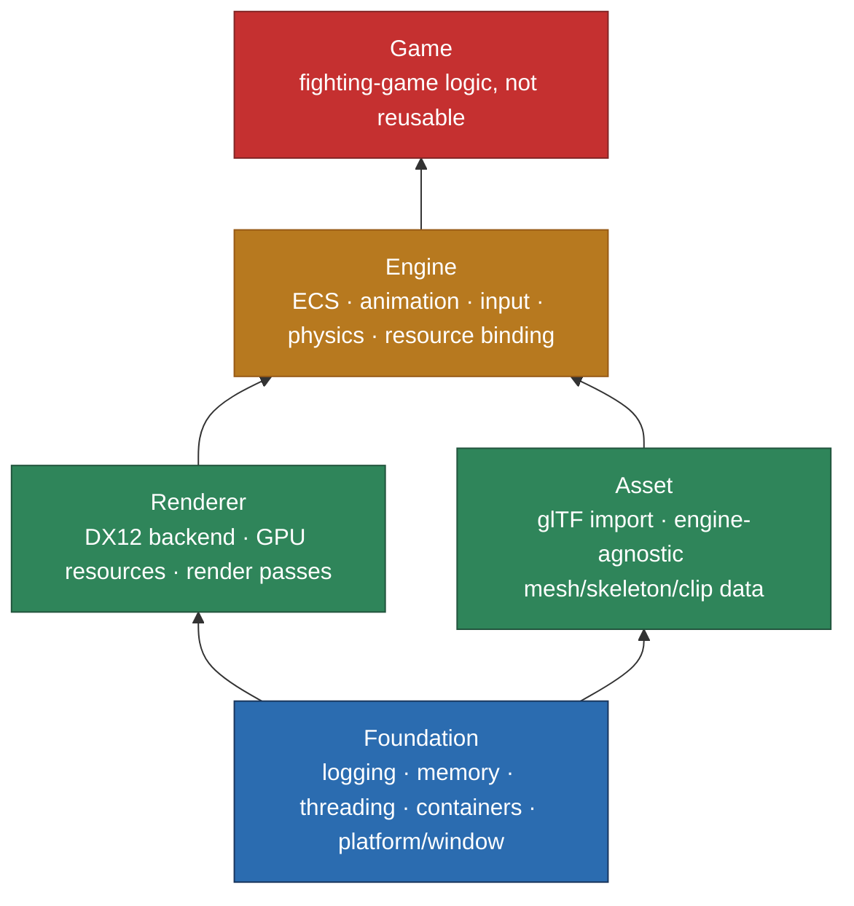

# OmdLab

A small hobby game engine via Ai assisted programming. Targetting a simple 2D-camera fighting game built with minimalistic 3D characters. Built on Dx12.

## Architecture

| Project | Role | Depends on |
|---|---|---|
| `Foundation` | Platform layer, logging, memory tracking, threading, core containers. | — |
| `Renderer` | Generic DX12 abstraction: device, GPU resources, render passes, pipelines. No knowledge of game or asset concepts. | `Foundation` |
| `Asset` | Import-format-agnostic mesh/skeleton/animation data structures, populated by a glTF importer. | `Foundation` |
| `Engine` | ECS, animation runtime, input, physics/collision, fixed-timestep simulation, and the resource layer connecting `Asset` data to `Renderer` GPU resources. | `Foundation`, `Renderer`, `Asset` |
| `Game` | Fighting-game-specific logic and content. Not reusable. | `Engine` |

## Building

1. Run `GenerateSolution.bat` from the repo root to generate the Visual
   Studio solution/project files under `projects/` (regenerate any time
   `build/*.sharpmake.cs` changes).
2. Open `projects/omdlab_win64_vs2022.sln` and build. The first build
   requires internet access: it restores the DirectX Agility SDK via NuGet
   and copies its runtime DLLs next to the built executable.

## Status

Work in progress.
